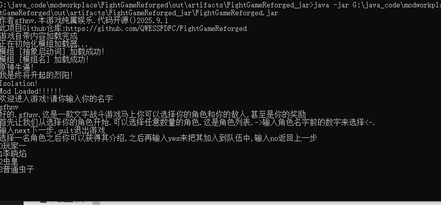

中文:
这是一个使用java编写的游戏.目前只有文字,大概能正常玩了?代码随便用,随便改.我是高中生,没时间.偶尔更新.编写此项目只是为了图一乐,发到Github上纯粹是闲的没事.目前没有使用java的相关游戏引擎,只是自己写东西,自娱自乐.......
暂不接受 Pull Request。如果你有改进想法，请 fork 本仓库后自行修改，自由使用。我只想自己写点东西玩玩.
使用方法:直接运行.jar文件.可以自己编译或者下载Release中编译好的.但是Release中版本可能落后一点.

下面是使用AI写的README.md


---

FightGameReforged

一个由高中生从零编写的命令行回合制文字战斗游戏 —— 纯 Java 实现，事件驱动架构，支持模组加载。

---

📖 项目简介

这是一个基于 Java 的命令行回合制战斗游戏。玩家可以组建队伍、选择敌人、手动操控角色释放技能，在文字界面中体验策略对战的乐趣。

项目采用事件驱动架构，通过自定义 EventBus 和 @SubscribeEvent 注解解耦游戏逻辑，为后续扩展打下基础。同时内置了模组系统，支持动态编译
.java 源码并加载外部模组，方便添加新生物、技能与物品。

作者是一名热爱编程与游戏开发的高中生，写这个项目纯粹为了图一乐。代码随便用，随便改，欢迎 fork.
暂不接受 Pull Request。如果你有改进想法，请 fork 本仓库后自行修改，自由使用。

---

✨ 核心特色

· 经典回合制战斗：玩家自由组建队伍，选择敌人与奖励，手动操控每个角色释放技能。
· 五行元素体系：引入金、木、水、火、土五种元素，设计了对应的抗性与伤害加成机制。
· 事件驱动架构：通过自定义 EventBus 和 @SubscribeEvent 注解解耦游戏逻辑，为扩展性打下基础。
· 内置模组系统：可自动扫描并加载外部模组，支持动态编译 .java 源码，方便添加新生物、技能与物品。
· Utility AI 控制器：非玩家角色基于 Tag 权重系统进行决策——每个实体拥有独立的 Tag 权重（体现性格），结合实时情境（血量等）计算行动得分，选出最优行为。
· MIT 开源许可：代码完全开放，随意使用、修改、分发。

---

🛠️ 技术栈

项目 说明
语言 Java (JDK 25+)
构建工具 IntelliJ IDEA（原生）
核心依赖 无外部依赖（纯 Java 标准库）

---

🚀 快速开始

方式一：直接运行 JAR（推荐）

1. 前往 Releases 下载最新 .jar 文件
2. 在终端中执行：
   ```bash
   java -jar FightGameReforged.jar
   ```

⚠️ Release 中的版本可能略落后于主分支，如需最新特性请参考方式二。

方式二：从源码编译运行

1. 克隆仓库：
   ```bash
   git clone https://github.com/QWESSFDFC/FightGameReforged.git
   ```
2. 使用 IntelliJ IDEA 打开项目
3. 运行主类：cn.gfhnv.game.GameStarter
4. 按照命令行提示开始游戏

📁 项目包含2个示例模组 exampleModByGFHNV和abstractLaunchingWords,位于 mods/ 目录下，可作为模组开发参考。

---


📁 项目结构

```
FightGameReforged/
├── src/cn/gfhnv/game/
│   ├── annotation/      # 自定义注解（如 @SubscribeEvent）
│   ├── damage/          # 伤害计算与元素克制系统
│   ├── effect/          # 战斗效果（Buff/Debuff）
│   ├── entity/          # 实体（角色、怪物）
│   ├── entityController/# 控制器（不含 Utility AI 决策系统）
│   ├── event/           # 事件总线与事件定义
│   ├── inventory/       # 背包系统
│   ├── item/            # 物品定义
│   ├── mod/             # 模组加载器
│   ├── officialStuff/   # 官方内容（预设角色/技能）
|   └── system           #战斗系统,思考系统,log系统,mana,甚至是简单的物理
├── mods/                # 外部模组存放目录
└── README.md
可能还有没有列出的文件夹
```

---

🧠 关于 AI 决策系统（ThinkingController）

非玩家实体的行为由 ThinkingController 控制，其核心机制基于 效用型 AI（Utility AI）：

· 每个实体拥有独立的 Tag 权重表（如攻击、防御、治疗、回蓝、增伤等），体现其性格。
· 每回合控制器会读取实体当前的 Tag 权重，并结合实时情境因子（血量百分比、蓝量、敌人距离、元素克制等）计算每个行动的最终得分。
· 系统自动选出得分最高的行动执行，实现智能且风格各异的 NPC 行为。

这种设计的优势在于：

· 解耦：Tag 权重与行动逻辑分离，新增行为只需添加对应 Tag 和分数计算。
· 可调试：决策过程可打印为日志，方便定位 AI 行为异常的原因。
· 可扩展：支持“心情指数”、临时修正、随机扰动等进阶玩法。

---

🤝 贡献与反馈

报告 Bug / 提出建议：欢迎提交 Issue，我会尽量抽空查看，但可能无法及时响应或修复（毕竟学业繁忙,学校太不做人了）。

代码贡献：暂不接受 Pull Request。如果你有改进想法，请 fork 本仓库后自行修改，自由使用。

---

📄 许可证

本项目采用 MIT License 开源协议，代码完全开放，随意使用、修改、分发。

---

作者：一名热爱编程与游戏开发的高中生 | 项目始于 2025 年 9 月 1 日


This is a game written in Java. For now, it's text‑only, and I guess it's mostly playable? Use and modify the code however you like. I'm a high school student, so I don't have much time. I update it occasionally. I wrote this project just for fun, and uploading it to GitHub was purely because I had nothing better to do. It doesn't use any Java game engine — I just write my own stuff for my own amusement.

**Pull Requests are not accepted at this time.** If you have ideas for improvement, please fork the repository and modify it for your own use. I just want to write a little something and enjoy myself.

How to run: directly execute the .jar file. You can compile it yourself or download the pre‑built version from Releases. However, the Release version may lag slightly behind.

Below is the README.md written with the help of AI.

---

# FightGameReforged

A command‑line turn‑based text battle game written from scratch by a high school student — pure Java implementation, event‑driven architecture, with mod loading support.

---

## 📖 Project Overview

This is a Java‑based command‑line turn‑based battle game. Players can form a team, choose enemies, manually control characters to cast skills, and experience the fun of strategic combat in a text interface.

The project adopts an event‑driven architecture, decoupling game logic through a custom EventBus and @SubscribeEvent annotations, laying a foundation for future expansions. It also includes a built‑in mod system that supports dynamic compilation of .java source files and loading of external mods, making it easy to add new creatures, skills, and items.

The author is a high school student passionate about programming and game development. This project was written purely for fun. The code is free to use and modify — you are welcome to fork it.  
**Pull Requests are not accepted.** If you have improvements, please fork the repository and modify it for your own use.

---

## ✨ Core Features

- **Classic turn‑based combat**: freely build your team, choose enemies and rewards, and manually control each character's skill usage.
- **Five‑element system**: incorporates Metal, Wood, Water, Fire, and Earth elements, with corresponding resistance and damage bonus mechanics.
- **Event‑driven architecture**: decouples game logic via a custom EventBus and @SubscribeEvent annotations, enhancing extensibility.
- **Built‑in mod system**: automatically scans and loads external mods, supports dynamic compilation of .java source files, facilitating the addition of new creatures, skills, and items.
- **Utility AI controller**: non‑player characters make decisions based on a Tag weight system — each entity has its own Tag weights (reflecting personality), combined with real‑time context (HP, etc.) to compute action scores and select the optimal behavior.
- **MIT open‑source license**: code is fully open, free to use, modify, and distribute.

---

## 🛠️ Tech Stack

| Item          | Description                         |
|---------------|-------------------------------------|
| Language      | Java (JDK 25+)                      |
| Build tool    | IntelliJ IDEA (native)              |
| Dependencies  | None (pure Java standard library)   |

---

## 🚀 Quick Start

### Option 1: Run the JAR directly (recommended)

1. Go to [Releases](https://github.com/QWESSFDFC/FightGameReforged/releases) and download the latest `.jar` file.
2. Execute in your terminal:
   ```bash
   java -jar FightGameReforged.jar
   ```

⚠️ The Release version may be slightly behind the main branch. For the latest features, refer to Option 2.

### Option 2: Compile and run from source

1. Clone the repository:
   ```bash
   git clone https://github.com/QWESSFDFC/FightGameReforged.git
   ```
2. Open the project with IntelliJ IDEA.
3. Run the main class: `cn.gfhnv.game.GameStarter`.
4. Follow the command‑line prompts to start the game.

📁 The project includes two example mods, `exampleModByGFHNV` and `abstractLaunchingWords`, located in the `mods/` directory, which can serve as references for mod development.

---


---

## 📁 Project Structure

```
FightGameReforged/
├── src/cn/gfhnv/game/
│   ├── annotation/      # Custom annotations (e.g., @SubscribeEvent)
│   ├── damage/          # Damage calculation and element counter system
│   ├── effect/          # Battle effects (Buffs/Debuffs)
│   ├── entity/          # Entities (characters, monsters)
│   ├── entityController/# Controllers (excluding Utility AI decision system)
│   ├── event/           # Event bus and event definitions
│   ├── inventory/       # Inventory system
│   ├── item/            # Item definitions
│   ├── mod/             # Mod loader
│   ├── officialStuff/   # Official content (preset characters/skills)
|   └── system           # Battle system, thinking system, log system, mana, and even simple physics
├── mods/                # Directory for external mods
└── README.md
There may be additional folders not listed here.
```

---

## 🧠 About the AI Decision System (ThinkingController)

The behavior of non‑player entities is controlled by `ThinkingController`, whose core mechanism is based on **Utility AI**:

- Each entity has its own Tag weight table (e.g., attack, defend, heal, restore mana, amplify damage, etc.), reflecting its personality.
- Each turn, the controller reads the entity's current Tag weights and combines them with real‑time situational factors (HP percentage, mana, enemy distance, element counter, etc.) to compute a final score for every possible action.
- The system automatically selects the action with the highest score, enabling intelligent and varied NPC behavior.

**Advantages of this design:**

- **Decoupling**: Tag weights are separated from action logic; adding a new action only requires adding the corresponding Tag and score calculation.
- **Debuggability**: The decision process can be printed as logs, making it easy to identify why an AI behaves unexpectedly.
- **Extensibility**: Supports advanced features like "mood index", temporary modifiers, random perturbations, etc.

---

## 🤝 Feedback & Communication

- **Bug reports / Suggestions**: Welcome to open an Issue. I will try to read them when I have time, but I may not respond quickly or fix everything (school keeps me very busy – it's brutal).
- **Code contributions**: **Pull Requests are not accepted.** If you have improvements, please fork the repository and modify it for your own use.

---

## 📄 License

This project is licensed under the MIT License. The code is fully open, free to use, modify, and distribute.

---

**Author**: a high school student passionate about programming and game development | Project started on September 1, 2025


