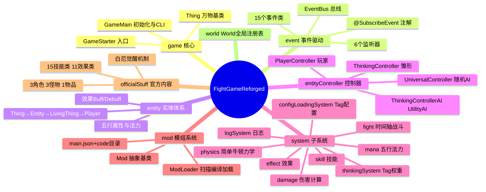
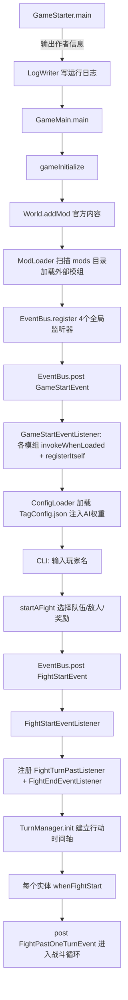
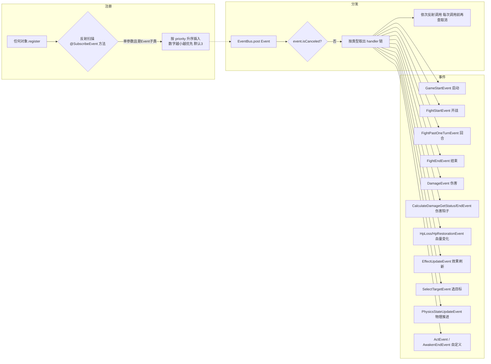
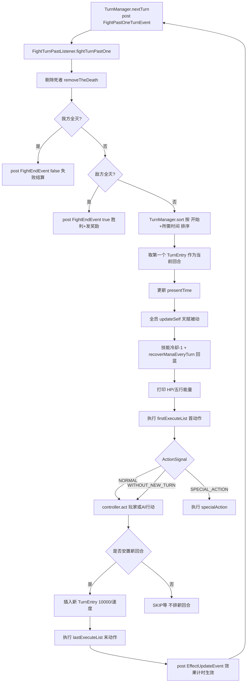
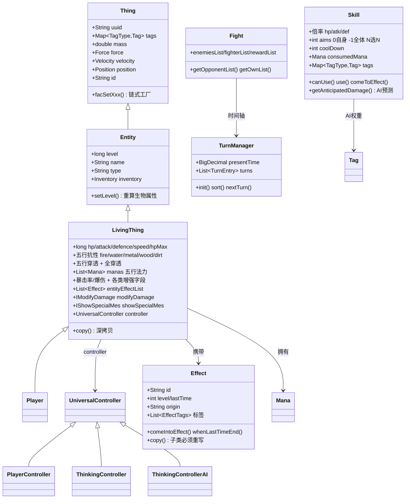
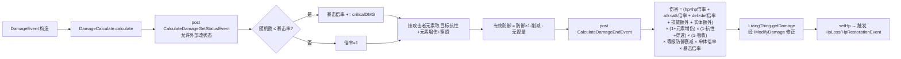
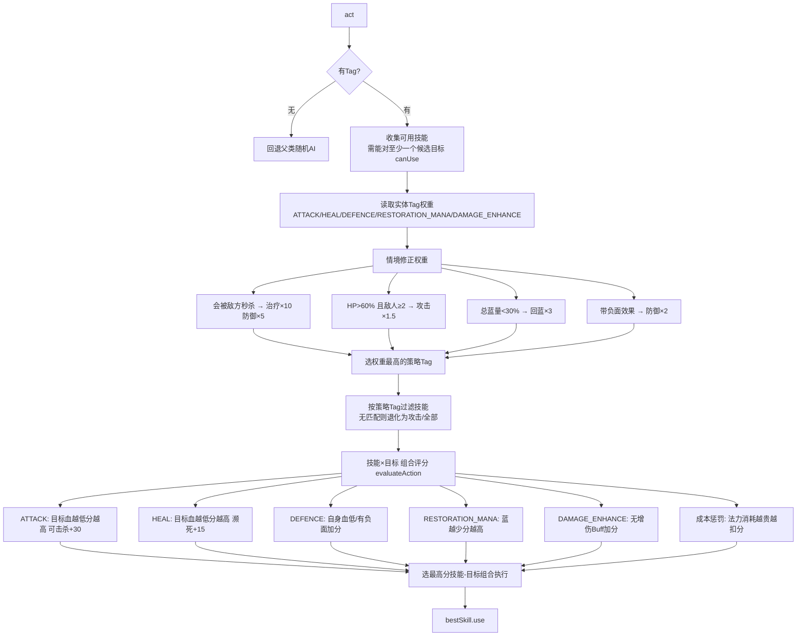
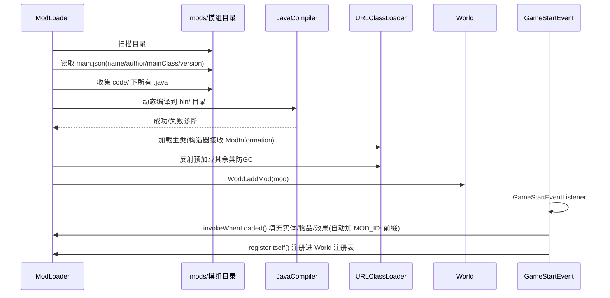

# FightGameReforged 项目分析报告

> ⚠️ **历史文档（第 1 轮分析 · 约 2026-08-14 · 复核范围 110 个 Java 文件）**：
> 本文档中列出的**绝大多数缺陷已在后续轮次修复**，部分结论也已被后续源码推翻。
> 请以 **[`ANALYSIS-review4.md`](ANALYSIS-review4.md)（第 4 轮，最新）** 与当前源码为准；
> 保留本文档仅供追溯分析过程。

> **声明**：本文档由 AI（DeepSeek）基于对仓库源码的阅读自动生成，未经作者人工核对，仅供参考。生成时通读了 `../src/cn/gfhnv` 下全部 110 个 Java 源文件的关键部分，并参考了仓库自带的 `ProjectStatus.txt` 与 `../README.md`。
>
> 生成日期：2026 年8.14（以实际生成时间为准）。

---

## 一、项目概览

| 维度 | 内容 |
|------|------|
| 类型 | 命令行回合制文字战斗游戏（纯 Java，未使用游戏引擎） |
| 版本 / 构建 | v1.2.1（`../build.gradle`）；Gradle + Shadow 插件打包 fat jar |
| 语言 | Java 25（`sourceCompatibility/targetCompatibility = VERSION_25`） |
| 依赖 | 仅 `org.json:json:20240303` |
| 入口 | `cn.gfhnv.game.GameStarter` → `GameMain` |
| 代码规模 | 110 个 Java 文件（`../src/cn/gfhnv/game` 主体 + `../src/cn/gfhnv/debug_tools` 测试代码） |
| 许可证 | MIT（作者：高中生 gfhnv，仓库暂不接受 Pull Request） |
| 目录 | 另有 `../mods`（2 个示例模组）、`../config`、`../logs`、`../screenshots` 等 |

**核心设计点**：事件驱动架构（自定义 EventBus + `@SubscribeEvent` 注解）、基于 BigDecimal 的行动时间轴回合制、金木水火土五行元素与五行法力双资源、Utility AI（Tag 权重决策）、运行时动态编译并加载外部模组。

---

## 二、启动与初始化流程

启动链路：`GameStarter`（打印作者信息、写运行日志）→ `GameMain.gameInitialize()`（注册官方内容 → 加载外部模组 → 注册全局监听器 → 发布 `GameStartEvent` → 加载 Tag 配置）→ 命令行选择角色 / 敌人 / 奖励 → 发布 `FightStartEvent` 开战。

---

## 三、事件驱动架构

`EventBus` 为全局静态总线：注册时反射扫描监听器上带 `@SubscribeEvent` 注解的方法（要求恰好一个参数且参数必须是 `Event` 子类），按 `priority`（数字越小越优先，默认 3）升序插入；`post` 时按事件类型取出 handler 链逐个反射调用，调用前检查 `event.isCanceled()`。事件基类提供 `isCanceled/setCanceled`。

事件清单（`event` 包 14 个类 + 官方内容自定义 `AwakenEndEvent`）：

| 事件 | 用途 |
|------|------|
| `GameStartEvent` | 游戏启动，触发模组加载 |
| `FightStartEvent` | 战斗开始，初始化时间轴 |
| `FightPastOneTurnEvent` | 每回合推进（战斗循环核心） |
| `FightEndEvent` | 战斗结束，胜负结算与发奖 |
| `DamageEvent` | 一次伤害结算的载体 |
| `HpLossEvent` / `HpRestorationEvent` | 生命值减少 / 恢复 |
| `EffectUpdateEvent` | 效果计时与生效 |
| `SelectTargetEvent` | 目标选择完成 |
| `PhysicsStateUpdateEvent` | 物理状态推进 |
| `CalculateDamageGetStatusEvent` / `CalculateDamageEndEvent` | 伤害计算前后钩子 |
| `ActEvent` | 行动（预留） |
| `AwakenEndEvent`（官方自定义） | 白厄觉醒结束 |

监听器（`eventListener` 包）：`GameStartEventListener`（模组加载）、`FightStartEventListener`（开战初始化）、`FightTurnPastListener`（回合主循环）、`FightEndEventListener`（结束结算与清理）、`EffectEventListener`（效果计时）、`PhysicsEventListener`（牛顿力学积分）。

---

## 四、战斗系统：时间轴回合循环

模型：每个生物的行动间隔为 `10000 / speed`（BigDecimal，10 位小数），回合条按 `startTime + needTime` 排序，支持按百分比/固定值加速与延迟，从而自然实现"额外回合、加速、延迟"等机制。`TurnEntry` 携带 `ActionSignal`（`NORMAL / SPECIAL_ACTION / WITHOUT_NEW_TURN / SKIP / SKIP_WITHOUT_NEW_TURN`）、首/末执行的特殊动作列表（`ISpecialAction`）与 `isExtra`（额外回合）标记。

回合内流程（`FightTurnPastListener`）：剔除死者并判定胜负 → 排序取最近行动者 → 更新时间 → 全员 `updateSelf()`（天赋被动）→ 技能冷却 -1、恢复五行法力 → 打印状态（HP + 金木水火土能量）→ 执行首动作 → 按 `ActionSignal` 让控制器行动或执行特殊动作 → 决定是否安置新回合 → 执行末动作 → 发布 `EffectUpdateEvent` → 递归触发下一回合。

效果刷新（`EffectEventListener`）：无限效果（`EffectTags.INFINITE`）只生效不减持续；持续时间耗尽触发 `whenLastTimeEnd` 并移除；额外回合（`isExtra`）不扣持续回合数。

---

## 五、类继承体系

各层要点：

- **Thing**：万物基类。UUID（`equals/hashCode` 依据）、行为 Tag 权重表（`Map<TagType, Tag>`，供 Utility AI 使用）、简单的牛顿力学属性（质量/力/速度/加速度/位置）、注册表 id。提供 `facSetXxx` 链式工厂方法。
- **Entity**：等级、名称、类型、背包（`Inventory`）。`setLevel()` 若自身是 `LivingThing` 会按成长系数重算生命/防御/攻击并初始化五行法力。
- **LivingThing**：战斗属性主体。五行抗性、五行穿透、全属性穿透、伤害吸收、暴击率/爆伤、各类百分比+固定值增强字段（getter 综合返回最终值）、五行法力列表、效果列表、伤害修正接口 `IModifyDamage`、特殊状态显示 `IShowSpecialMes`、控制器 `UniversalController`。提供完整深拷贝构造器，并按原控制器类型重建 `PlayerController / ThinkingControllerAI / UniversalController`。`setHp` 会发布 `HpLossEvent / HpRestorationEvent` 并夹在 `[0, hpMax]`。
- **Player**：`LivingThing` 的子类，仅提供构造与 `copy()`。

五行法力初始化：主元素法力上限 `成长×(等级-1)+200`，其余元素 `成长×(等级-1)+20`；每回合恢复 `等级/100×成长 + 100`，主元素额外恢复 `等级`。

---

## 六、伤害计算

入口 `DamageEvent` → `DamageCalculate.calculate()`，公式综合生命/攻击/防御三系倍率、元素增伤、抗性与穿透、伤害吸收、等级防御衰减、单体倍率与暴击，前后各有一个事件钩子（`CalculateDamageGetStatusEvent` / `CalculateDamageEndEvent`）允许外部修改。

---

## 七、控制器与 Utility AI

- **PlayerController**：命令行交互。选择是否用物品（每回合最多一次，不占用技能回合）→ 列出技能与冷却 → 选择技能 → 多目标逐个选择（Set 去重）。敌方角色若被分配给玩家控制器则回退父类随机 AI。
- **UniversalController**：通用随机 AI。筛选可用技能 → 随机选技能 → 按 `isForEnemies` 与阵营确定目标池 → 随机选 N 个目标（`aims=-1` 全体）→ `use` 后发布 `SelectTargetEvent`。
- **ThinkingController**：Utility AI 雏形。读取 Tag 权重、预测敌方下回合最大伤害、计算各策略占比，但最终仍回退 `super.act()`（未完成）。
- **ThinkingControllerAI**：完整的 Utility AI 实现（下述）。

Tag 类型（`TagType`）：`ATTACK / HEAL / RESTORATION_MANA / DEFENCE / DAMAGE_ENHANCE / CONTROL_ENEMIES`。技能持有 `Map<TagType, Tag>` 标明自己的行为标签；实体 Tag 权重可通过 `../config/gameConfig/TagConfig.json` 配置（首次运行自动写入默认配置，按实体/物品 id 注入）。

---

## 八、模组系统：编译即加载

- 目录约定：`mods/<模组名>/main.json` + `code/`（.java 源码），编译产物自动生成到 `bin/`（每次加载前删除重建）。
- `main.json` 必需字段：`name / author / description / mainClass / version`。
- 加载流程：扫描 `../mods` → 解析 `main.json` → 用 `JavaCompiler` 把 `code/` 下全部 .java 编译到 `bin/` → 用 `URLClassLoader` 加载主类（构造器需接收 `ModInformation`）→ 反射预加载其余类防止被 GC → `World.addMod()` 注册。随后由 `GameStartEvent` 触发 `invokeWhenLoaded()`（填充内容）与 `registerItself()`（注册进 `World` 注册表）。
- `Mod` 抽象基类：持有实体/物品/效果 List；通过 `addXxx` 添加的内容自动加 `MOD_ID:` 前缀避免 id 冲突；建议在 `invokeWhenLoaded()` 中填内容（官方内容 `OfficialGameContent` 在构造器中直接注册，文档明确标注"不要学这个"）。
- 示例模组：`exampleModByGFHNV`、`abstractLaunchingWords`。

---

## 九、模块速览

| 包 | 职责 |
|---|---|
| `annotation` | `@SubscribeEvent(priority=3)` 事件订阅注解 |
| `damage` | `Damage`（伤害载体）+ `DamageCalculate`（公式与事件钩子） |
| `effect` | `Effect` 基类 + `EffectTags`（INFINITE/NEGATIVE/POSITIVE/SKIP_ACTION/CAUSE_DAMAGE） |
| `entity` | `Thing→Entity→LivingThing→Player` 继承链与深拷贝 |
| `entityController` | 玩家交互 / 随机 AI / 两个思考控制器 |
| `event` / `eventListener` | 事件总线 + 14 个事件 + 6 个监听器 |
| `interfaces` | `IModifyDamage`（伤害修正）、`IShowSpecialMes`（特殊状态显示）、`ISpecialAction`（首/末动作） |
| `inventory` | `Slot` 格子制背包，支持堆叠、合并、排序 |
| `item` | `Item` 基类（`comeToEffect` 使用效果），继承 `Thing` 拥有物理属性与 Tag |
| `mod` | `ModLoader` / `Mod` / `ModInformation` / `JavaSourceCode` |
| `skill` | `Skill` 基类（倍率、目标数、冷却、五行消耗、AI 标签、伤害预测 `getAnticipatedDamage`） |
| `system` | 五行枚举、时间轴战斗、Tag 思考、五行法力、物理、配置加载、日志、物品使用（空包 `useItemSystem`） |
| `world` | `World` 全局静态注册表（实体/物品/效果/模组/运行时 Thing） |
| `officialStuff` | 官方角色 / 怪物 / 物品 / 技能 / 效果 / 事件 |
| `debug_tools` | `TestAnticipateDamage`、`actionBarTest`（回合制原型测试） |

其他子系统：

- **物理系统**（`system/physics`）：`Vector` + `Force/Velocity/Acceleration/Position` 子类；`PhysicsEventListener` 监听 `PhysicsStateUpdateEvent`，按牛顿力学 `a=F/m`、`v+=a`、`pos+=v` 推进所有参战实体并清零力。当前战斗中未见实际使用点，属于预留能力。
- **日志系统**（`system/logSystem`）：`LogWriter` 追加写 `../logs/latest.log`，超 10MB 归档为带时间戳的 `*.log`。
- **配置系统**（`system/configLoadingSystem`）：`ConfigLoader` 读取 `../config/gameConfig/TagConfig.json`，为实体与物品注入 AI Tag 权重；文件缺失时写入默认配置。
- **World**：`thingList`（运行时实例，开战后加入）与 `itemList / entityList / effectList / modList`（模板注册表）分离；`getLivingEntityList()` 过滤注册表中的 `LivingThing`。

---

## 十、官方内容（officialStuff）

- **角色**（3 个，`customEntity/players`）：
  - `PlayerOne`（初始角色）
  - `ActorLiXiaoYan`（李逍遥：蓄力、终极攻击、配合 `MemorizedHp` 记忆血量效果）
  - `Phainon`（白厄）——最复杂的官方角色，见下。
- **怪物**（3 个，`customEntity/monsters`）：`CommonInsect`（普通虫）、`IceInsect`（冰虫，可冰冻敌人）、`InsectBoss`（虫王，可召唤小弟）。
- **物品**（1 个，`customItem`）：`ANiceSword`（好剑）。
- **技能**（15 个类，`customSkill`）：通用 4 个（普攻/冰冻/枪击/回血）、李逍遥 3 个、虫王召唤 1 个、白厄普通 2 个 + 觉醒 5 个（觉醒普攻/烬灭令/反击/死星天裁/终末一击）。
- **效果**（11 个类，`customEffect`）：通用 10 个（攻击/防御/速度/HP 增强、暴击率/爆伤增强、增伤、冰冻、无视防御、回血）+ 李逍遥 `MemorizedHp`。
- **自定义事件**（`customEvent`）：李逍遥 `DamageEventListener`；白厄 `AwakenEndEvent` / `AwakeEndListener` / `FightStartAndSelectEventListener`。

**白厄（Phainon）觉醒机制**（官方内容中最复杂的机制）：

1. 初始火种 15（上限 15），大招消耗 12 火种觉醒为「卡厄斯兰那」。
2. 觉醒：攻击增强 +80%、生命上限 +270% 并回满血、获得 **8 个额外回合**（`TurnEntry.setExtra(true)`，按 60% 速度间隔插入）、获得毁伤计数（上限 7，初始 4）。
3. 觉醒技能组：觉醒普攻、烬灭令（消耗毁伤）、死星天裁、反击（额外回合首动作中若毁伤>0 触发）、终末一击。
4. 觉醒期间每回合清除自身全部负面效果（`updateSelf` 重写）；觉醒结束时发布 `AwakenEndEvent` 并结算终末一击、回收火种 +3。
5. 锁血机制：通过 `IModifyDamage` 实现——觉醒状态下致命伤害强制留 1 点 HP（每场一次），并在回合末自动执行「终末一击」。
6. 战斗结束 `whenFightEnds` 重置火种/毁伤/觉醒状态并注销监听器。

---

## 十一、已知问题与风险（基于代码阅读，客观列出）

1. **递归驱动回合**：`FightTurnPastListener` 通过 `EventBus.post(FightPastOneTurnEvent)` 递归推进自身，超长战斗可能触发栈溢出（回合数受默认栈深限制）。
2. **静态状态**：`TurnManager`、`EventBus`、`World` 均为静态字段，不支持并发与多局并行；`World.things` 等运行时数据跨局累积（开局通过 `addThing` 追加而非清空）。
3. **取消机制不彻底**：`Event.isCanceled` 只在分发前与每个 handler 调用前检查，不会中断已经开始执行的 handler 链。
4. **输入解析不一致**：`PlayerController.useItem` 使用 `SCANNER.nextInt()`，与 `GameMain` 的 `nextLine()` 混用可能遗留换行符影响后续输入。
5. **空指针风险**：`UniversalController.act` 以 `canUse(fight, owner, null)` 调用三参版本；基类忽略该参数无碍，但子类若重写并解引用该列表可能 NPE。
6. **数组与列表不同步**：`GameMain.startAFight` 中 `livingThings` 数组取自 `World.getLivingEntityList()` 的快照，若在开局过程中注册表被修改，可能出现索引越界。
7. **输出混杂**：游戏文本直接 `System.out`，与日志、调试信息混在同一终端。
8. **未完成/预留代码**：`useItemSystem` 包为空；`ThinkingController` 决策框架存在但未完成（实际使用 `ThinkingControllerAI`）；物理系统已实现但战斗内未见调用；`ActEvent` 未见发布方。

---

## 十二、与仓库自带 `ProjectStatus.txt` 的差异说明

仓库根目录自带一份 AI 生成的 `ProjectStatus.txt`（2026.8.12）。经与当前源码比对：

- 其总体架构描述（事件总线、时间轴回合制、模组编译加载、五行体系）与当前代码一致。
- 已过时的内容：`ProjectStatus.txt` 称"ThinkingController 未完成、所有 NPC 实际走随机 AI"——当前代码已新增 **`ThinkingControllerAI`**（完整的 Utility AI 评分决策），`LivingThing` 复制构造器也会按控制器类型正确重建它。
- 当前代码新增而旧报告未提及的：`ISpecialAction` 接口与首/末动作机制、`customAction/SkipTurn`、`HpRestorationEvent`、`useItemSystem`（空包）、`debug_tools` 测试代码。
- 旧报告提到的"LivingThing 复制构造器 tags 判断条件写反"在当前代码中已修复。

---

## 十三、总体评价（客观总结）

- **优点**：事件驱动解耦了战斗、模组与内容扩展；BigDecimal 时间轴让"加速/延迟/额外回合"机制实现简洁；"JavaCompiler 编译即加载"的方案对纯 Java 文字游戏实用；五行元素 + 五行法力双资源体系有设计深度；`ThinkingControllerAI` 的 Utility AI 具备权重-情境修正-组合评分-成本惩罚的完整决策链路。
- **局限**：静态全局状态与递归回合推进限制了规模与并发；部分系统（物理、物品使用、ThinkingController）处于预留/未完成状态；命令行直接输出导致游戏文本与日志混杂。
- **定位**：作为个人学习与娱乐项目，代码结构与扩展思路清晰，适合作为事件驱动架构、回合制战斗与模组系统的参考原型。

---

*本文档由 AI 生成，仅供参考。如需更精确的信息，请以源码为准。*
